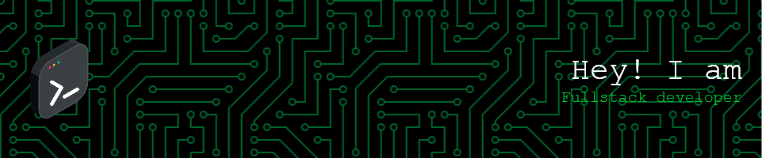

# 💫 About Me:
🔭 I’m currently working on PMSPrototype 🌱 I’m currently learning Backend 💬 Ask me about  ⚡ Fun fact You can find me on Google[mohd saif protoype]

## 🌐 Socials:
   

# 💻 Tech Stack:
                     
# 📊 GitHub Stats:
 
 

### ✍️ Random Dev Quote

---

  ## 💰 You can help me by Donating
   

  
<!-- Proudly created with GPRM ( https://gprm.itsvg.in ) -->